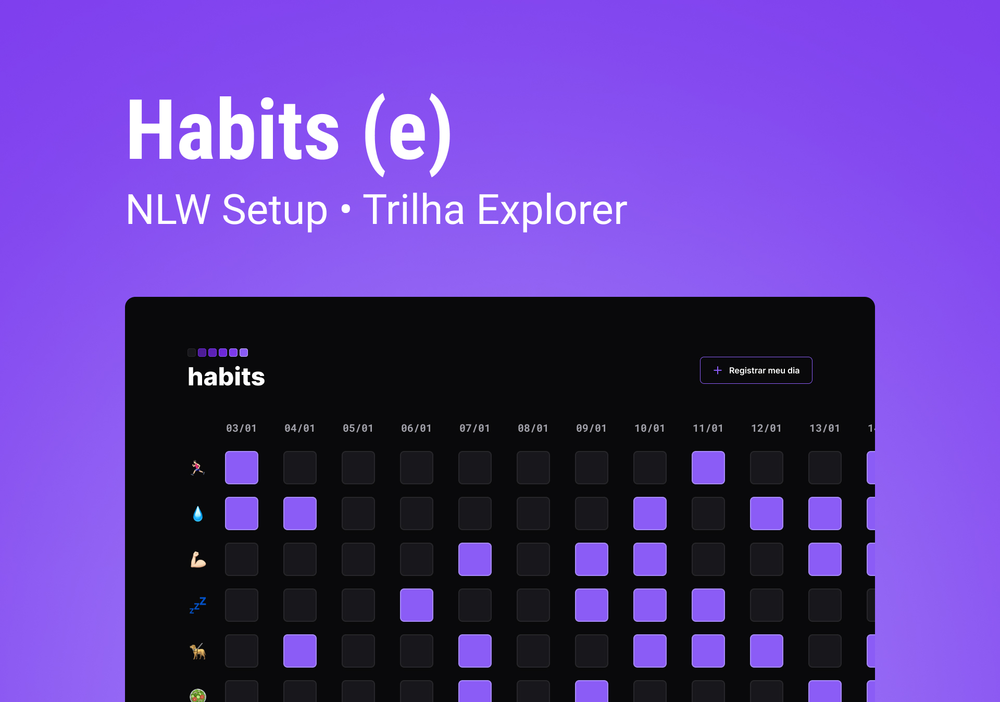

<h1 align="center"> Habits </h1>

Programa exclusivo e gratuito, promovido pela Rocketseat para ensino de tecnologias WEB.  

  

 

  

## 🚀 Tecnologias

Esse projeto foi desenvolvido com as seguintes tecnologias:

- HTML e CSS
- JavaScript
- Git e Github
- Figma

## 💻 Projeto

O HABITS é um app para ajudar a registrar e rastrear os hábitos.

- Acesse o app através [DESSE LINK](https://itsBINHO.github.io/NLW-SETUP/).

## 🔖 Layout

Você pode visualizar o layout do projeto através [DESSE LINK](https://www.figma.com/file/Dq3czjiL7RpcXcSLmDlhT1/Habits-(e)-(Community)?node-id=6%3A344&t=1kyboqVjG3JR72gt-0). É necessário ter conta no [Figma](https://figma.com) para acessá-lo.

##  Licença

Esse projeto está sob a licença MIT.